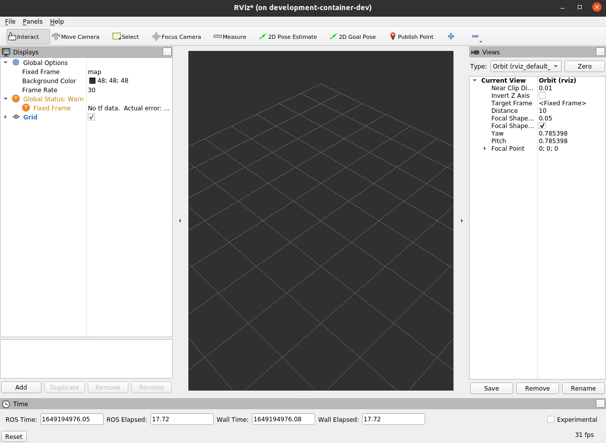

[](https://github.com/PickNikRobotics/ros_testing_templates/actions/workflows/ci.yaml)
# development-container
The development container allows developers to sandbox repository dependencies
from their host machine while allowing them to use familiar development tools.

# TL;DR
Build a new development image

**Note**: The `REPO` variable is defined in `.env`

```
source .env
mkdir -p ~/.${REPO}/ccache
export UID=$(id -u) export GID=$(id -g); docker compose -f compose.dev.yml build
```
Start an interactive development container
```
docker compose -f compose.dev.yml run development
```
Build the repository in the container
```
username@development-container-dev:~/ws$ colcon build
```

# Test
To test that your container is working with graphics
```shell
username@development-container-dev:~/ws$ colcon build
username@development-container-dev:~/ws$ source install/setup.bash
username@development-container-dev:~/ws$ ros2 launch platform_description display.launch.py
```

#### Dependencies
Repository dependencies are built into the development image. This insulates the
developer from potentially conflicting dependencies on their host while preventing
development from accidentally depending on host packages and configurations.
This uniform development environment should also make it easier for developers
to collaboratively troubleshoot issues.

#### Rebuilding image
As repository dependencies change, the development image will have to be rebuilt.
While early on this can happen frequently, dependencies tend to change more slowly later in a project.
Unless otherwise noted, it is a good habit to update your image once a sprint.

#### <a id="ccache"></a> ccache
`ccache` allows previous builds to speed up future builds. As the container is
not persistent, we need to map the cache to the host so it can be reused in
subsequent instantiations of the container.
On the host, create the cache directory
```
mkdir -p ~/.${REPO}/ccache
```
This will then be mapped to `/home/username/.ccache` in the container.

#### Volume mapping
While the container itself by default is not persistent, several host directories
are mapped into the container including
- repository source code
- ssh keys
- git configuration
- host credentials
- X11 connection

This allows for a more seamless development environment for
- building source
- in container committing with your user
- graphical tool use

The full set of volume maps can be read in the [compose file](compose.dev.yml).

#### git
Commits can be done from directly within the container, with the same host user.
```
username@development-container-dev:~/ws/src$ git config --list
user.email=firstname.lastname@email.com
user.name=Firstname Lastname
core.editor=vim
core.repositoryformatversion=0
core.filemode=true
core.bare=false
core.logallrefupdates=true
remote.origin.url=git@github.com:griswaldbrooks/development-container.git
remote.origin.fetch=+refs/heads/*:refs/remotes/origin/*
branch.main.remote=origin
branch.main.merge=refs/heads/main
```

#### Graphics
Running rviz from within the container should produce a graphical
window on the host.

```
username@development-container-dev:~/ws/src$ rviz2
```


#### Editing
As the repository source is volume mapped into the container, it can be edited
outside of the container and changes are immediately reflected inside the container.
This means you can use your existing host tools (vim, atom, sublime, vs code)
to develop, and build in the container.

# Prerequisites
## docker
Taken from https://docs.docker.com/engine/install/ubuntu/

#### Check version
If docker is already installed, the below steps may not be required
```shell
$ docker version
Client: Docker Engine - Community
 Version:           20.10.12
 API version:       1.41
 Go version:        go1.16.12
 Git commit:        e91ed57
 Built:             Mon Dec 13 11:45:33 2021
 OS/Arch:           linux/amd64
 Context:           default
 Experimental:      true

Server: Docker Engine - Community
 Engine:
  Version:          20.10.12
  API version:      1.41 (minimum version 1.12)
  Go version:       go1.16.12
  Git commit:       459d0df
  Built:            Mon Dec 13 11:43:42 2021
  OS/Arch:          linux/amd64
  Experimental:     false
 containerd:
  Version:          1.4.13
  GitCommit:        9cc61520f4cd876b86e77edfeb88fbcd536d1f9d
 runc:
  Version:          1.0.3
  GitCommit:        v1.0.3-0-gf46b6ba
 docker-init:
  Version:          0.19.0
  GitCommit:        de40ad0

```
The development image was tested with version 20.10.12.

#### Download and install
```shell
curl -fsSL https://get.docker.com -o get-docker.sh
sudo sh get-docker.sh
```
Note, the above script does not cover removing old versions.

#### Post actions
Adding yourself to the `docker` group and refreshing shell obviates the need
to run `sudo` with `docker`.
```shell
sudo groupadd docker
sudo usermod -aG docker $USER
newgrp docker
```

## docker compose v2
Taken from https://docs.docker.com/compose/cli-command/#install-on-linux

#### Download release
```shell
DOCKER_CONFIG=${DOCKER_CONFIG:-$HOME/.docker}
mkdir -p $DOCKER_CONFIG/cli-plugins
curl -SL https://github.com/docker/compose/releases/download/v2.2.3/docker-compose-linux-x86_64 -o $DOCKER_CONFIG/cli-plugins/docker-compose
```

#### Apply permissions
```shell
chmod +x $DOCKER_CONFIG/cli-plugins/docker-compose
```

#### Test
```shell
docker compose version
```

## nvidia-docker
TODO: It is unconfirmed if `nvidia-docker` is required on hosts with nvidia gpus.
Currently, `rviz2` has been tested with
- `nvidia-docker` and nvidia gpu
- no `nvidia-docker` and intel gpu
and it produced comparable frame rates to the host.
There is also a question if this is obviated by installing the gpu driver
in the container and if that is best practice.

# Alias
While developing a tool on top of another tool can come with challenges,
some may prefer to at least have some simple aliases to reduce the typing boilerplate.
```shell
alias builddev="export UIDGID=$(id -u):$(id -g); docker compose -f compose.dev.yml build"
alias rundev="export UIDGID=$(id -u):$(id -g); docker compose -f compose.dev.yml run development"
```

As an aside, a handy way to find a previous command is
```shell
history | grep keyword
```
to rerun the command using the offset number given from `history`
```shell
!offsetnumber
```

# Troubleshooting
#### ccache cannot compile
```
"/usr/lib/ccache/cc"

  is not able to compile a simple test program.
```
Likely, the host ccache directory in your [home directory](#ccache) was not created properly.
Ensure that the directory is created and owned by the host user.
```
mkdir -p ~/.${REPO}/ccache
sudo chown -R $(id -u):$(id -g) ~/.${REPO}/ccache
```

# Additional Information
## CppCon 2023 Slides

The code in `functional_programming_tests` was actually presented at CppCon 2023 and ROSCon 2023. The abstract of the presentation is: 

```
In the field of robotics, Robot Operating System (ROS) is the de facto middleware of choice across academia and industry.
As most code examples in ROS utilize an object-oriented approach, challenges can arise when writing tests for production code due to the boilerplate code ROS introduces, often leading to unexpected bugs or flaky tests.
This talk explores ways to mitigate those issues by using a functional approach.
By adopting this approach, we can minimize the impact that ROS or other middleware has on your code, preventing it from becoming tightly coupled and brittle.
Attendees can expect an overview of ROS 2 and the conventional programming approach typically associated with it.
We'll delve into how tests are usually constructed and pinpoint potential sources of bugs and flakiness.
Following this, we will introduce a functional approach to writing test code.
By the end of this talk, attendees will learn an alternative method of architecting their ROS 2 code and also understand how this approach can lead to more robust, maintainable, and testable code.
```

The slides are located in `doc`.
